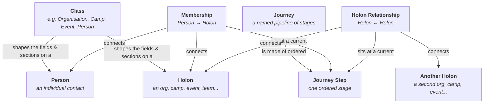

# METIS Concepts Diagram

A visual map of the handful of ideas everything else in METIS is built from. If you've read
[Getting started](../web/app/getting-started.md) and [Focus](../web/app/focus-and-scoping.md)
and want the "how do the pieces fit together" picture before diving into a specific app, this
is that picture. Every box below links to the fuller doc on that concept.

---

## The map

## What each box means

| Concept | Plain-English meaning |
|---|---|
| **Person** | An individual you're tracking — a contact, a volunteer, a participant. Might or might not have a METIS login. |
| **Holon** | METIS's word for "everything that isn't a Person": an organisation, a camp, an event, a team. Holons can nest — an event can belong to an organisation, which can belong to a parent org. |
| **Class** | The "type" that decides what a Holon or Person actually is (Organisation vs. Camp vs. Event vs. Person) and what fields/sections show up on it. See [Holons and classes](../metis_apps/metis/holons-and-classes.md). |
| **Journey** | A named, reusable pipeline — a template like "Volunteer Onboarding" or "Partner Outreach" — made of ordered **Steps** (Invited → Confirmed → Active, etc.). |
| **Journey Step** | One stage in a Journey. Whoever/whatever is "on" a Journey sits at exactly one Step at a time. |
| **Membership** | How a **Person's** relationship to a **Holon** is tracked — it's the Person's live position on a Journey. Example: Alice's Membership tracks her progress through "Volunteer Onboarding" for The Gathering Earth. |
| **Holon Relationship** | The same idea, but between two **Holons** instead of a Person and a Holon. Example: a Sponsor org's relationship to an event, tracked through a "Sponsor Relationship" Journey. |

## A worked example

- **Alice** is a **Person**.
- **The Gathering Earth** is a **Holon** of Class **Organisation**.
- Alice's connection to that org is a **Membership** — right now it sits at the **Active** Step
  of the **Contributor Membership** Journey.
- Separately, **Camp Ignite** is a **Holon** of Class **Camp**, and its relationship to The
  Gathering Earth (its parent org) is a **Holon Relationship** on a **Camp Lead Relationship**
  Journey.

Everything you see on a person's or org's profile — the "current step" badge, the kanban board
you drag cards across, the journey picker — is this same handful of concepts, just rendered
different ways depending on where you're looking.

## Where this shows up in the app

- **Focus** picks which Holon scopes what you see — see
  [Focus: the holon scoping model](../web/app/focus-and-scoping.md).
- **People & Orgs** is where you work with Persons, Holons, Memberships, and Holon
  Relationships day to day — see [Working with people & orgs](../metis_apps/metis/people-and-orgs.md).
- **Journeys** (the model reference, with the full list of built-in Person/Holon journeys and
  steps) — see [Journeys](JOURNEY.md).
- **Additional fields** are the custom, per-Class fields you can add on top of a Holon or
  Person's built-in ones — see [Holon Additional Fields](../metis_apps/metis/info-fields.md).

## One specialised case worth knowing about

Coherence's **Conversations** (the recorded meetings IRIS publishes) use this exact same
pattern under the hood — a Conversation is a Journey position, same as a Membership or Holon
Relationship, just for a different kind of thing. You don't need the general model to
understand Coherence, though: see
[Events & Conversations](../metis_apps/coherence/events-and-conversations.md) for that side
told on its own terms.
